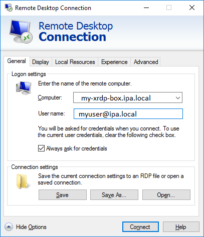
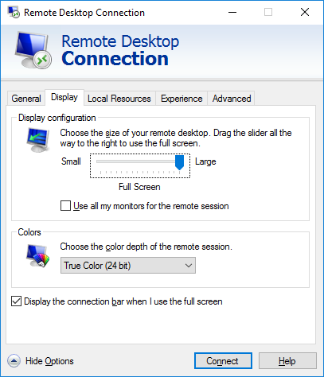
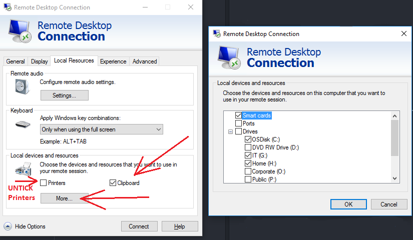
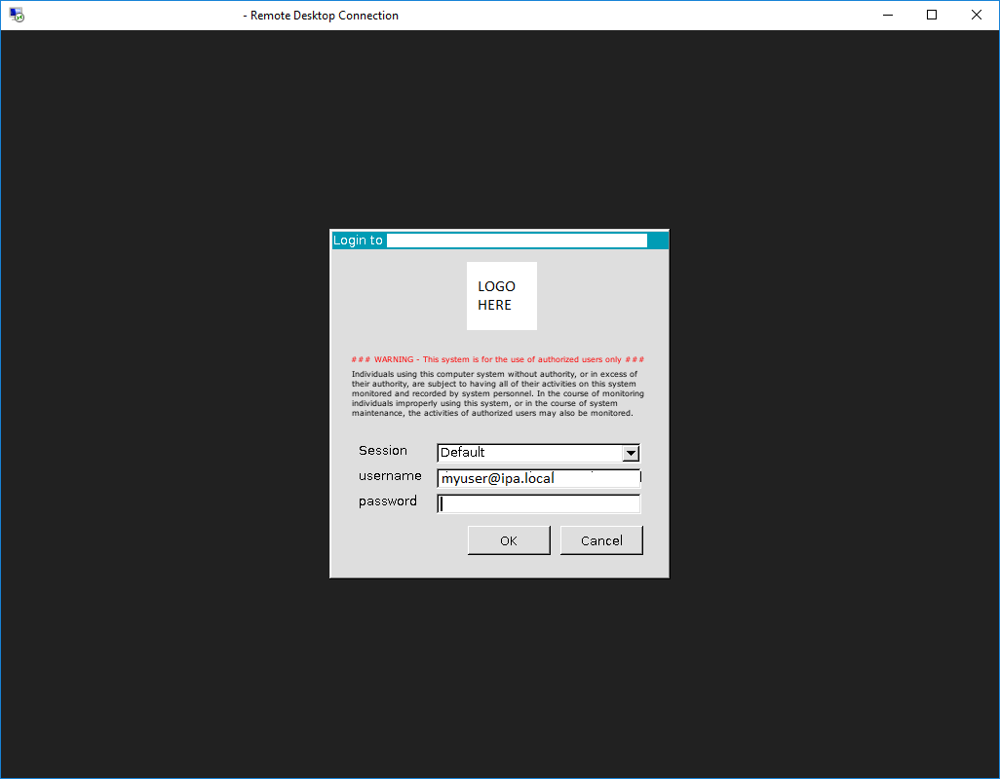
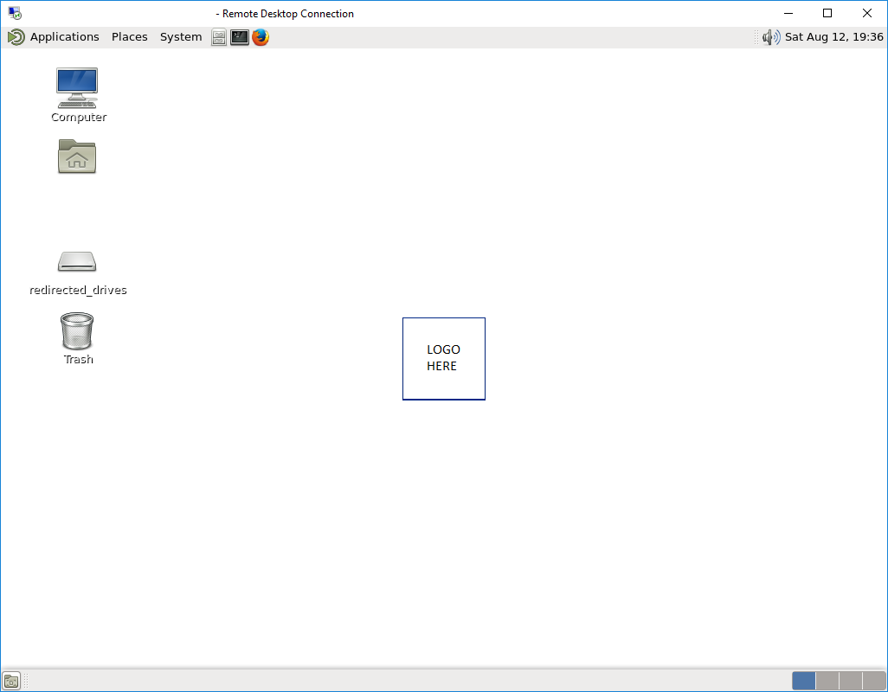
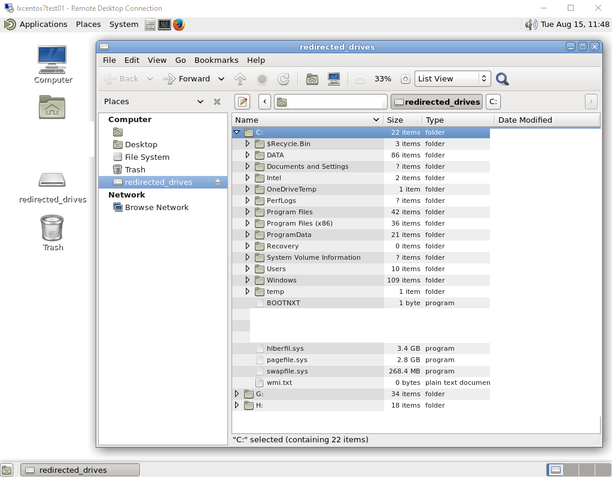

# Ansible XRDP GUI Project

## Update
```bash
# Add this to the end of your /etc/bashrc to allow apps to run as root with gui
xhost +si:localuser:root

# Then you can just run this: sudo caja
```

### XRDP provides great:
* RDP Protocol compatibility
* TLS encrytion
* Good performance
* Remote drives redirection

## Vagrant quick start on Windows + Virtualbox
* Install Vagrant
* Install Virtualbox
* Install Vagrant plugin: `vagrant plugin install vagrant-vbguest`
* Run `vagrant up`
* Run `mstsc /v:localhost:13389`
  * Username: `vagrant`
  * Password: `vagrant`

#### Build
```bash
cd vagrant
vagrant plugin install vagrant-vbguest
vagrant up
```

#### Destroy
```bash
vagrant halt -f
vagrant destroy -f
```

## Quick start on a CentOS 7 test box
* Make sure ansible-pull can become root without password (edit visudo)

```bash
yum -y install git ansible htop
sudo ansible-pull --purge --clean --force --url="https://github.com/DRN88/ansible-xrdp-gui.git" --checkout="master" --inventory="environments/local/inventory" playbooks/local.yml
```

## Custom Themes available
Added 2 backgrounds and reusing some built-in themes:
* Light1 (default)
* Dark1

## Known issues
* ~~Drive redirection does not work every time~~  
  * Workaround in: `/usr/libexec/xrdp/startwm-mate-session.sh` with `fusermount -u "$HOME/redirected_drives"`
* If `Printers` is enabled on `Local devices and resources` redirection it breaks the rest of the resources (Clipboard, Drive redirections). Please untick `Printers`

## Recommended RDP connection settings on Windows 10
* Set username in advance
* Set screen to Fullscreen
* Set Color depth 24bit
* Enable remote audio
* Enable clipboard
* Click on `More...` button --> Enable drive redirection

  

  

  




